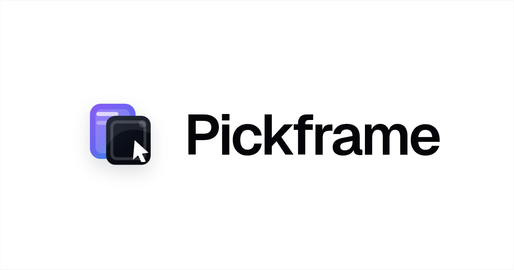

<div align="center">
  <a href="https://pickframe.sdjz.wiki">
    
  </a>
  <h3>The design selection workbench.</h3>
  <p>
    Lay out, compare, annotate, pick, and export many versions of mini-app
    design mocks &mdash; in one place, in your browser.
  </p>
  <p>
    <a href="https://pickframe.sdjz.wiki"><b>pickframe.sdjz.wiki</b></a>
  </p>
  <p>
    
    
    
    
  </p>
</div>

## What is Pickframe?

When a real product ships, you don't review *one* design &mdash; you review
**ten variations of a page** across **a dozen pages**. The usual tooling
(Figma, Slack threads, Dropbox folders) makes that painful: thumbnails
get lost, comments scatter, "which one did we pick again?" becomes a
recurring meeting.

Pickframe is a single workbench for the entire selection loop:

- **Lay out** every page and every version side by side, in an Eagle-style
  three-pane workspace.
- **Compare** 2&ndash;4 mocks with synchronised zoom and pan.
- **Annotate** in place &mdash; pen, highlight box, arrow, sticky note &mdash;
  with full undo/redo on a real canvas.
- **Pick** with intent: rate, tag, mark `winner` / `picked` / `partial` /
  `rejected`. One page can have multiple "good in parts" mocks but only
  one final winner.
- **Export** the result as a contact-sheet PDF, a per-page ZIP of
  annotated PNGs, or a single PNG &mdash; everything client-side.

Everything lives in your browser via IndexedDB. No upload, no account,
no backend. Open the tab, drop a folder of mocks, and start.

## Highlights

- **Three-pane workspace** &mdash; project / page tree on the left, masonry
  board in the middle, inspector on the right. Familiar to anyone who
  has used Eagle, Linear, or Figma.
- **Board / Compare / Single views** &mdash; `⌘1` / `⌘2` / `⌘3`.
- **First-class keyboard** &mdash; `⌘K` command palette, `W` to mark winner,
  `1`&ndash;`5` for ratings, `Space` for quick-look, `A` to annotate,
  `⌘E` to export.
- **Real canvas annotation** &mdash; pressure-aware freehand
  (perfect-freehand), highlight rectangles, snap-to-axis arrows, sticky
  notes. Drawn vectors, not pixels, so they re-render crisply on export.
- **Smart filters** &mdash; verdict, tags, ratings, has-annotations,
  date range. Save any combination as a view.
- **Static, edge-cached** &mdash; the whole app is a `next export` static
  bundle. Vercel POPs serve it; nothing on the request path is
  serverless.
- **Capsule brand mark** rendered as inline SVG, so the favicon, splash,
  topbar and OG card stay consistent across every surface.

## Quick start

```bash
pnpm install
pnpm dev          # http://localhost:3000
pnpm build        # produces ./out (static export)
pnpm lint
pnpm typecheck
```

Drop a folder of PNGs/JPGs on the empty workspace and the seed flow will
create a starter project for you.

## Tech stack

| Layer | Choice |
|---|---|
| Framework | Next.js 16 (App Router, static export) |
| Language | TypeScript (strict) |
| Styling | Tailwind CSS v4 |
| UI primitives | Radix UI + custom components |
| State | Zustand + Immer |
| Persistence | IndexedDB via Dexie |
| Canvas | HTML Canvas + `perfect-freehand` |
| Export | `jsPDF` + `JSZip` + `file-saver` |
| Motion | Framer Motion |
| Icons | Lucide |
| Command palette | `cmdk` |

## Deployment

This repo deploys to Vercel as a fully static site. The build command is
`pnpm build`, output directory is `out`, no runtime is required.

Set `NEXT_PUBLIC_SITE_URL=https://pickframe.sdjz.wiki` in the Vercel
project so Open Graph and Twitter cards resolve to absolute URLs in
production. Preview deployments fall back to `VERCEL_URL` automatically.

The committed `vercel.json` configures:

- 1-year `immutable` `Cache-Control` on all hashed Next assets, fonts,
  and images.
- Hardened response headers
  (`X-Content-Type-Options`, `Referrer-Policy`, `Permissions-Policy`,
  HSTS, frame options).

## License

Pickframe is released under the **PolyForm Noncommercial License 1.0.0**.

You may use, modify, and share it for any **non-commercial** purpose.
Commercial use is **not** permitted under this license. For commercial
licensing, contact <a href="mailto:shuakami@sdjz.wiki">shuakami@sdjz.wiki</a>.

See [LICENSE](./LICENSE) for the full text.
